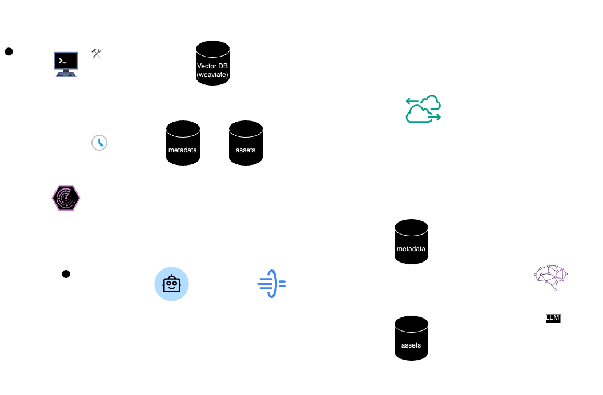

# 🧠 Babel Foundation

_Capture, store, and share human consciousness and memories. Bridging minds with advanced AI and LLM technology. Documentation, landing page, and resources for the Babel project._

The Babel Foundation is pioneering the future of human connection by capturing, storing, and sharing human consciousness and memory assets. It aims to bridge minds and foster a global network of shared knowledge by providing a seamless infrastructure for preserving and sharing personal and collective experiences.

The Babel Foundation is dedicated to enhance the way we capture, store, and share human consciousness and memories.

### Our Vision

To break down the barriers of individual knowledge and foster a deeper, more connected world where personal and collective memories enrich our lives and understanding.

### Our Mission

- **Capture**: Develop innovative methods to record and preserve personal and external memories securely.
- **Store**: Implement robust, encrypted storage solutions to ensure the safety and integrity of memory data.
- **Share**: Enable effortless sharing of memories. Create seamless and intuitive ways for individuals to share their memories, fostering empathy and collaboration.

### Core Values

- **Innovation**: Continuously push the boundaries of technology to enhance memory management.
- **Security**: Prioritize the privacy and protection of user data.
- **Community**: Build a supportive and inclusive environment for users and contributors.

### Projects

- [**Babel API**](https://github.com/margostino/babel-api): The gateway service for interacting with Babel data. This API processes natural language queries, searches indexed metadata, and returns relevant responses by leveraging advanced Large Language Models (LLMs).
- [**Babel Bot**](https://github.com/margostino/babel-bot): A conversational AI bot that interacts with users to capture, store, and retrieve memories.
- [**Babel Agent**](https://github.com/margostino/babel-agent): A daemon agent that syncs memory assets from local store to remote and keep index metadata up-to-date.
- [**Babel CLI**](https://github.com/margostino/babel-cli): A command-line interface for managing Babel data and interacting with the Babel data.

### Arthitecture

  

Join us in redefining the future of human connection. Explore, contribute, and be a part of the Babel Foundation. Together, we can create a tapestry of shared human experiences.
